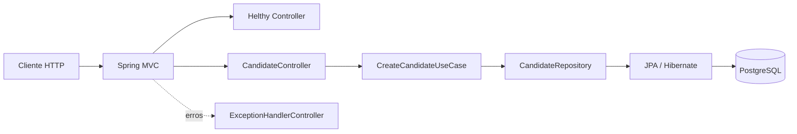
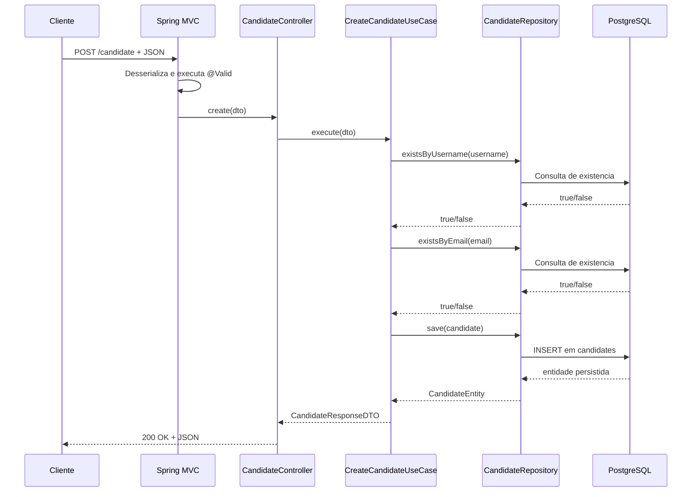
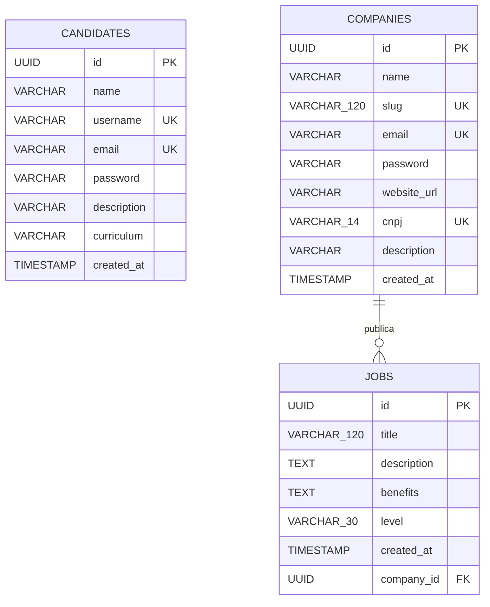
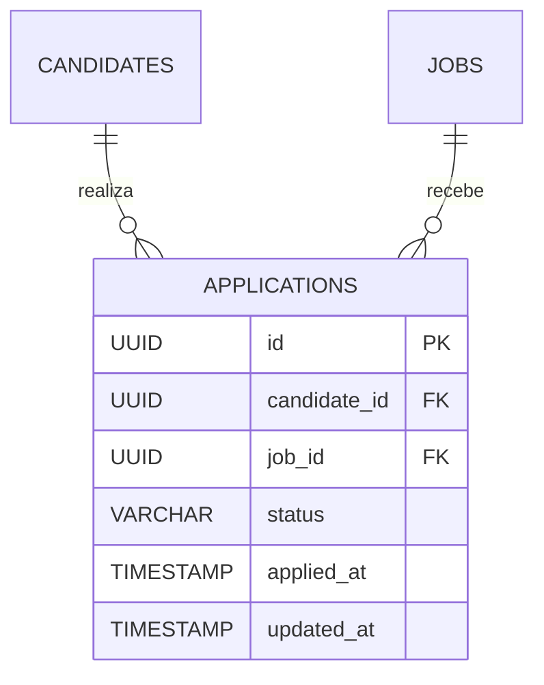
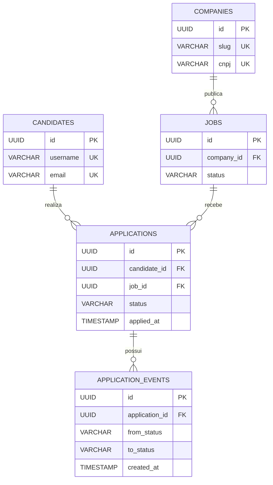

# Hiring Platform - Explicacao completa do projeto

## Sumario

1. [Objetivo e estado atual](#1-objetivo-e-estado-atual)
2. [Visao geral da arquitetura](#2-visao-geral-da-arquitetura)
3. [Tecnologias e dependencias](#3-tecnologias-e-dependencias)
4. [Estrutura do repositorio](#4-estrutura-do-repositorio)
5. [Inicializacao e configuracao](#5-inicializacao-e-configuracao)
6. [Explicacao de cada parte do codigo](#6-explicacao-de-cada-parte-do-codigo)
7. [Fluxos da aplicacao](#7-fluxos-da-aplicacao)
8. [API HTTP](#8-api-http)
9. [Banco de dados](#9-banco-de-dados)
10. [Decisoes de modelagem e persistencia](#10-decisoes-de-modelagem-e-persistencia)
11. [Validacao e tratamento de erros](#11-validacao-e-tratamento-de-erros)
12. [Seguranca](#12-seguranca)
13. [Testes e documentacao automatizada](#13-testes-e-documentacao-automatizada)
14. [Infraestrutura e operacao](#14-infraestrutura-e-operacao)
15. [Limitacoes, riscos e inconsistencias atuais](#15-limitacoes-riscos-e-inconsistencias-atuais)
16. [Evolucao recomendada](#16-evolucao-recomendada)
17. [Glossario](#17-glossario)

---

## 1. Objetivo e estado atual

O projeto **Hiring Platform** e o backend de uma plataforma de recrutamento. O dominio ja comeca a representar os tres elementos centrais desse tipo de sistema:

- **candidatos**, que criam seus perfis;
- **empresas**, que seriam responsaveis por publicar oportunidades;
- **vagas**, que pertencem a uma empresa e descrevem uma oportunidade de trabalho.

No estado atual, o projeto e uma **API REST monolitica** desenvolvida em Java com Spring Boot e persistencia em PostgreSQL. O projeto nao possui frontend neste repositorio.

E importante separar o que ja esta funcional do que esta apenas modelado:

| Area | Estado atual |
|---|---|
| Inicializacao da API | Implementada |
| Conexao com PostgreSQL | Configurada |
| Cadastro de candidato | Implementado |
| Validacao do cadastro | Implementada |
| Tratamento de validacao e conflito | Implementado parcialmente |
| Health check simples | Implementado em `GET /helthy` |
| Entidade de empresa | Modelada no banco, sem API |
| Entidade de vaga | Modelada no banco, sem API |
| Relacao empresa-vaga | Modelada |
| Cadastro e login de empresa | Nao implementados |
| Login de candidato | Nao implementado |
| Autenticacao e autorizacao | Nao implementadas |
| Candidatura a uma vaga | Nao modelada |
| Etapas do processo seletivo | Nao modeladas |
| Frontend | Nao existe neste repositorio |
| Migrations versionadas | Nao existem |
| Testes de regras e endpoints | Nao existem |

Assim, embora o nome do projeto represente uma plataforma completa de contratacao, a implementacao ainda esta em uma fase inicial: somente a criacao de candidato percorre todas as camadas da API ate o banco de dados.

---

## 2. Visao geral da arquitetura

### 2.1 Estilo arquitetural

O sistema e um **monolito Spring Boot organizado parcialmente por dominio**. Todos os componentes executam no mesmo processo Java e usam o mesmo banco PostgreSQL.

A funcionalidade de candidato esta dividida nas seguintes responsabilidades:

- **Controller**: recebe e responde requisicoes HTTP;
- **DTO de entrada**: define o contrato e as validacoes do JSON recebido;
- **Use case**: executa a regra de negocio de criacao;
- **Repository**: fornece acesso ao banco via Spring Data JPA;
- **Entity**: representa a tabela e o estado persistido;
- **DTO de resposta**: controla o que e devolvido ao cliente;
- **Controller Advice**: padroniza parte dos erros.

Esse desenho evita colocar toda a regra dentro do controller. Entretanto, ele nao e uma arquitetura hexagonal ou Clean Architecture estrita, pois o caso de uso depende diretamente de tipos do Spring, como `ResponseStatusException`, `HttpStatus` e `JpaRepository`.

### 2.2 Diagrama de componentes



### 2.3 Limites atuais

O sistema nao esta separado em microsservicos. Tambem nao ha mensageria, cache, armazenamento de arquivos, integracoes HTTP externas ou processamento assincrono. A comunicacao implementada e apenas:

```text
Cliente HTTP -> Aplicacao Spring Boot -> PostgreSQL
```

---

## 3. Tecnologias e dependencias

As dependencias estao declaradas em `pom.xml`.

### 3.1 Plataforma principal

| Tecnologia | Papel no projeto |
|---|---|
| Java 21 | Linguagem e versao alvo de compilacao |
| Spring Boot 4.1.0 | Inicializacao, autoconfiguracao e gerenciamento da aplicacao |
| Maven | Build, dependencias, testes e empacotamento |
| Maven Wrapper | Permite usar a versao esperada do Maven por `./mvnw` |

O artefato Maven e identificado por:

```text
groupId:    com.isaac
artifactId: hiring_platform
version:    0.0.1-SNAPSHOT
```

`SNAPSHOT` indica uma versao ainda em desenvolvimento.

### 3.2 Dependencias de producao

| Dependencia | Finalidade |
|---|---|
| `spring-boot-starter-webmvc` | Controllers REST, serializacao JSON, servidor HTTP e Spring MVC |
| `spring-boot-starter-data-jpa` | Repositories, JPA, Hibernate e gerenciamento de persistencia |
| `spring-boot-starter-validation` | Validacao Jakarta Bean Validation nos DTOs |
| `postgresql` | Driver JDBC para comunicacao com PostgreSQL |
| `spring-boot-devtools` | Reinicializacao e facilidades durante desenvolvimento |
| `lombok` | Geracao de getters, setters, construtores e builders |

### 3.3 Dependencias de teste e documentacao

| Dependencia/plugin | Finalidade pretendida |
|---|---|
| `spring-boot-starter-data-jpa-test` | Suporte de teste para persistencia |
| `spring-boot-starter-webmvc-test` | Suporte de teste para controllers e MockMvc |
| `spring-boot-starter-restdocs` | Base para documentacao gerada por testes |
| `spring-restdocs-mockmvc` | Captura requests e responses de testes MockMvc |
| `asciidoctor-maven-plugin` | Converte documentacao AsciiDoc em HTML |

O `pom.xml` configura o Asciidoctor na fase `prepare-package`. Contudo, ainda nao existem arquivos AsciiDoc, snippets gerados ou testes REST Docs. Portanto, essa infraestrutura esta preparada, mas ainda nao e usada de fato.

### 3.4 Tecnologias que nao estao presentes

Atualmente nao ha dependencias ou configuracoes para:

- Spring Security;
- JWT ou sessoes de autenticacao;
- BCrypt ou outro `PasswordEncoder`;
- Flyway ou Liquibase;
- OpenAPI/Swagger;
- Spring Boot Actuator;
- Redis ou cache;
- filas e mensageria;
- armazenamento de arquivos;
- observabilidade, metricas ou tracing;
- Testcontainers;
- frontend JavaScript/TypeScript.

---

## 4. Estrutura do repositorio

```text
hiring-plataform/
|-- .env.example
|-- .gitignore
|-- .mvn/
|   `-- wrapper/
|       `-- maven-wrapper.properties
|-- docker-compose.yaml
|-- mvnw
|-- mvnw.cmd
|-- pom.xml
|-- src/
|   |-- main/
|   |   |-- java/com/isaac/hiring_platform/
|   |   |   |-- HiringPlatformApplication.java
|   |   |   |-- domain/
|   |   |   |   |-- Helthy.java
|   |   |   |   |-- canditate/
|   |   |   |   |   |-- CandidateController.java
|   |   |   |   |   |-- CandidateEntity.java
|   |   |   |   |   |-- CandidateRepository.java
|   |   |   |   |   |-- dtos/
|   |   |   |   |   |   |-- CandidateResponseDTO.java
|   |   |   |   |   |   `-- CreateCandidateRequestDTO.java
|   |   |   |   |   `-- useCases/
|   |   |   |   |       `-- CreateCandidateUseCase.java
|   |   |   |   |-- company/
|   |   |   |   |   `-- CompanyEntity.java
|   |   |   |   `-- jobs/
|   |   |   |       |-- JobEntity.java
|   |   |   |       `-- JobLevel.java
|   |   |   `-- exceptions/
|   |   |       |-- ErrorMessageDTO.java
|   |   |       `-- ExceptionHandlerController.java
|   |   `-- resources/
|   |       `-- application.properties
|   `-- test/java/com/isaac/hiring_platform/
|       `-- HiringPlatformApplicationTests.java
`-- target/
```

### 4.1 Arquivos da raiz

#### `pom.xml`

E o descritor Maven. Define Java, versao do Spring Boot, dependencias e plugins de build.

#### `mvnw` e `mvnw.cmd`

Sao os executaveis do Maven Wrapper para Linux/macOS e Windows. Eles reduzem a necessidade de uma instalacao global do Maven.

#### `.env.example`

Documenta os nomes das variaveis necessarias para o PostgreSQL, sem incluir credenciais reais.

#### `.env`

Pode conter os valores locais. O arquivo esta ignorado pelo Git e nao deve ser versionado, pois pode conter senha de banco.

#### `docker-compose.yaml`

Define somente o container PostgreSQL usado no ambiente local. A aplicacao Java nao esta containerizada.

#### `target/`

Diretorio gerado pelo Maven com classes compiladas e outros artefatos. Ele nao faz parte do codigo-fonte e esta no `.gitignore`.

### 4.2 Observacao sobre nomes

Existem grafias incorretas incorporadas ao codigo atual:

- `canditate` deveria provavelmente ser `candidate`;
- `Helthy`, `helth` e `/helthy` deveriam provavelmente ser `Health`, `health` e `/health`.

Como esses nomes fazem parte de pacotes, classes e contrato HTTP, uma correcao deve atualizar referencias e consumidores da API.

---

## 5. Inicializacao e configuracao

### 5.1 Ponto de entrada

`HiringPlatformApplication.java` contem:

```java
@SpringBootApplication
public class HiringPlatformApplication {
    public static void main(String[] args) {
        SpringApplication.run(HiringPlatformApplication.class, args);
    }
}
```

`@SpringBootApplication` agrega as funcoes de configuracao, autoconfiguracao e busca de componentes. Como a classe esta no pacote raiz `com.isaac.hiring_platform`, o Spring encontra os controllers, services, repositories e demais componentes abaixo desse pacote.

### 5.2 Variaveis de ambiente

O projeto espera:

| Variavel | Significado | Obrigatoria na pratica |
|---|---|---|
| `POSTGRES_DB` | Nome do banco | Sim |
| `POSTGRES_USER` | Usuario do banco | Sim |
| `POSTGRES_PASSWORD` | Senha do banco | Sim |
| `POSTGRES_PORT` | Porta exposta no host | Sim para o Compose; no Spring existe default `5432` |

Exemplo de `.env` local:

```properties
POSTGRES_DB=hiring_platform
POSTGRES_USER=hiring_user
POSTGRES_PASSWORD=uma_senha_local
POSTGRES_PORT=5432
```

O arquivo real nao deve ser commitado.

### 5.3 `application.properties`

| Propriedade | Efeito |
|---|---|
| `spring.application.name=hiring_platform` | Nome logico da aplicacao |
| `spring.config.import=optional:file:.env[.properties]` | Carrega `.env` se o arquivo existir |
| `spring.datasource.url=...` | Monta a URL JDBC para PostgreSQL local |
| `spring.datasource.username=...` | Obtem o usuario do ambiente |
| `spring.datasource.password=...` | Obtem a senha do ambiente |
| `spring.datasource.driver-class-name=org.postgresql.Driver` | Seleciona o driver PostgreSQL |
| `server.port=8082` | Inicia a API na porta 8082 |
| `spring.jpa.hibernate.ddl-auto=update` | Solicita ao Hibernate que atualize o schema |
| `spring.jpa.show-sql=true` | Exibe SQL gerado nos logs |
| `hibernate.format_sql=true` | Formata o SQL dos logs |
| `hibernate.dialect=PostgreSQLDialect` | Usa particularidades SQL do PostgreSQL |

O prefixo `optional:` significa somente que a ausencia do arquivo `.env` nao interrompe imediatamente o carregamento da configuracao. As variaveis sem valor padrao ainda precisam estar disponiveis por outro meio para que o datasource seja configurado corretamente.

### 5.4 Como executar

1. Crie um `.env` local com base em `.env.example`.
2. Inicie o PostgreSQL:

```bash
docker compose up -d db
```

3. Inicie a API:

```bash
./mvnw spring-boot:run
```

4. A API ficara disponivel em `http://localhost:8082`.

Comandos adicionais:

```bash
./mvnw test
./mvnw package
docker compose logs db
docker compose down
```

`docker compose down` remove o container, mas preserva o volume nomeado. Usar a opcao `-v` tambem apagaria os dados locais e, por isso, deve ser feito apenas de forma consciente.

---

## 6. Explicacao de cada parte do codigo

### 6.1 Modulo de candidato

O pacote atual e `domain/canditate`.

#### `CandidateController`

Responsavel pela fronteira HTTP do candidato.

```text
POST /candidate -> valida o body -> chama CreateCandidateUseCase -> retorna DTO
```

O controller nao acessa o banco diretamente. `@RequiredArgsConstructor` faz o Lombok gerar o construtor que recebe `CreateCandidateUseCase`, permitindo injecao de dependencia pelo Spring.

`@Valid` dispara as validacoes declaradas no DTO. O retorno atual usa `ResponseEntity.ok`, portanto a criacao responde com `200 OK`.

#### `CreateCandidateRequestDTO`

E um `record` Java usado como contrato de entrada. Um DTO de entrada evita receber a entidade JPA diretamente, o que traz beneficios:

- controla os campos aceitos pela API;
- concentra validacoes de entrada;
- nao permite que o cliente escolha `id` ou `createdAt`;
- reduz o acoplamento entre contrato HTTP e persistencia.

Campos e regras:

| Campo | Regras atuais |
|---|---|
| `name` | Nao vazio; minimo de 2 caracteres |
| `username` | Nao vazio; minimo de 2; nenhum espaco |
| `email` | Nao vazio; formato de e-mail |
| `password` | Nao vazia; minimo de 4 caracteres |
| `description` | Nao vazia; entre 10 e 255 caracteres |
| `curriculum` | Nao vazio |

Nao ha normalizacao com `trim`, lowercase de e-mail, limite maximo para varios campos ou regra de complexidade adequada para senha.

#### `CreateCandidateUseCase`

Contem a regra de criacao:

1. verifica se o username ja existe;
2. verifica se o e-mail ja existe;
3. constroi uma `CandidateEntity`;
4. salva a entidade;
5. converte o resultado para `CandidateResponseDTO`.

Se username ou e-mail ja existir, lanca `ResponseStatusException` com status `409 Conflict`.

O caso de uso tem a anotacao `@Service`, tornando-o um bean gerenciado pelo Spring. Embora seja chamado de `UseCase`, ele ainda conhece detalhes HTTP e JPA. Essa escolha e simples para o tamanho atual, mas reduz o isolamento da regra de negocio.

#### `CandidateRepository`

```java
public interface CandidateRepository
        extends JpaRepository<CandidateEntity, UUID> {
    boolean existsByUsername(String username);
    boolean existsByEmail(String email);
}
```

O Spring Data implementa essa interface em tempo de execucao. Os nomes `existsByUsername` e `existsByEmail` sao interpretados e transformados em consultas de existencia, sem SQL manual.

Herdar `JpaRepository` disponibiliza operacoes como `save`, `findById`, `findAll` e `deleteById`, embora apenas `save` e os dois `existsBy...` sejam usados atualmente.

#### `CandidateEntity`

Representa a tabela `candidates`. As anotacoes Lombok geram getters, setters, construtores e builder.

Ela e uma entidade mutavel e nao possui validacoes Bean Validation proprias. Portanto, as regras do DTO protegem o endpoint atual, mas nao necessariamente outras formas futuras de gravacao.

#### `CandidateResponseDTO`

Define o contrato de saida:

```text
id, name, username, email, description, curriculum, createdAt
```

O metodo estatico `fromEntity` centraliza a conversao. A senha e propositalmente omitida, o que evita expo-la no JSON de resposta.

### 6.2 Modulo de empresa

`CompanyEntity` e a unica classe do modulo. Isso significa que a estrutura da tabela esta modelada, mas ainda nao ha comportamento de aplicacao para empresas.

Nao existem atualmente:

- `CompanyController`;
- DTOs de entrada ou saida;
- `CompanyRepository`;
- caso de uso de criacao, consulta ou alteracao;
- validacao de CNPJ, slug, URL ou credenciais;
- login de empresa.

### 6.3 Modulo de vagas

O modulo contem `JobEntity` e `JobLevel`.

`JobEntity` modela os dados da vaga e sua empresa proprietaria. `JobLevel` limita o nivel profissional a quatro constantes:

```text
JUNIOR, PLENO, SENIOR, ESPECIALISTA
```

Assim como empresas, vagas nao possuem controller, repository, DTO ou casos de uso. Nao e possivel criar ou consultar vagas pela API atual.

### 6.4 Health check

`Helthy.java` expoe `GET /helthy` e sempre retorna:

```json
{
  "message": "recebido"
}
```

Ele comprova que o processo HTTP responde, mas nao verifica se o PostgreSQL esta conectado ou se as dependencias estao saudaveis. Nao e equivalente a um health check completo do Spring Boot Actuator.

### 6.5 Tratamento global de excecoes

`ExceptionHandlerController` usa `@ControllerAdvice` para interceptar excecoes de todos os controllers.

Ele trata:

- `MethodArgumentNotValidException`, gerada quando um DTO com `@Valid` e invalido;
- `ResponseStatusException`, usada pelo caso de uso para conflitos.

`ErrorMessageDTO` e o formato basico de erro:

```json
{
  "message": "descricao do erro",
  "field": "campo relacionado ou null"
}
```

### 6.6 Teste de contexto

`HiringPlatformApplicationTests` usa `@SpringBootTest` e possui apenas `contextLoads()`. Esse teste tenta carregar o contexto completo, mas nao valida comportamentos com assertions.

Como nao existe profile de teste nem banco em memoria, o carregamento pode depender das variaveis de ambiente e do PostgreSQL disponivel.

---

## 7. Fluxos da aplicacao

### 7.1 Fluxo de cadastro de candidato



No caminho normal, o cadastro pode realizar tres interacoes com o banco: duas verificacoes de existencia e um `INSERT`.

### 7.2 Fluxo de validacao invalida

```text
JSON recebido
  -> Bean Validation encontra violacoes
  -> Spring lanca MethodArgumentNotValidException
  -> ExceptionHandlerController coleta os erros
  -> API responde 400 com uma lista de ErrorMessageDTO
```

O controller e o caso de uso nao sao executados quando a validacao do body falha.

### 7.3 Fluxo de conflito

```text
Username existente -> 409 "Esse username ja esta em uso"
Email existente    -> 409 "Esse e-mail ja esta em uso"
```

O username e verificado primeiro. Se os dois valores ja existirem, o erro de username sera retornado.

### 7.4 Fluxos ainda ausentes

Ainda nao ha implementacao para:

- autenticar candidatos ou empresas;
- criar empresas;
- publicar, listar, atualizar ou remover vagas;
- listar e filtrar oportunidades;
- candidatar-se a uma vaga;
- armazenar status ou etapas de uma candidatura;
- enviar e-mails ou notificacoes;
- fazer upload ou download de curriculo.

---

## 8. API HTTP

A API nao possui prefixo global nem versionamento. As rotas atuais ficam diretamente na raiz.

### 8.1 `GET /helthy`

Finalidade: verificar apenas se a API responde.

Request:

```http
GET /helthy HTTP/1.1
Host: localhost:8082
```

Response:

```http
HTTP/1.1 200 OK
Content-Type: application/json
```

```json
{
  "message": "recebido"
}
```

### 8.2 `POST /candidate`

Finalidade: cadastrar um candidato.

Exemplo:

```http
POST /candidate HTTP/1.1
Host: localhost:8082
Content-Type: application/json
```

```json
{
  "name": "Maria Silva",
  "username": "maria.silva",
  "email": "maria@example.com",
  "password": "senha123",
  "description": "Desenvolvedora backend com experiencia em Java.",
  "curriculum": "https://example.com/curriculos/maria.pdf"
}
```

Resposta implementada:

```http
HTTP/1.1 200 OK
Content-Type: application/json
```

```json
{
  "id": "68cc7093-f6f6-4a66-bbb2-254416addb71",
  "name": "Maria Silva",
  "username": "maria.silva",
  "email": "maria@example.com",
  "description": "Desenvolvedora backend com experiencia em Java.",
  "curriculum": null,
  "createdAt": "2026-07-28T15:30:00.123456"
}
```

O `curriculum` aparece como `null` porque o caso de uso atual nao copia esse campo para a entidade. Isso e uma inconsistência da implementacao, nao uma caracteristica recomendada do contrato.

### 8.3 Erro de validacao

Status `400 Bad Request`:

```json
[
  {
    "message": "Digite um e-mail válido",
    "field": "email"
  },
  {
    "message": "O senha precisa ter no mínimo 4 caracteres",
    "field": "password"
  }
]
```

### 8.4 Erro de duplicidade

Status `409 Conflict`:

```json
{
  "message": "Esse username já está em uso",
  "field": null
}
```

ou:

```json
{
  "message": "Esse e-mail já está em uso",
  "field": null
}
```

### 8.5 Semantica REST atual

Algumas decisoes sao funcionais, mas ainda podem evoluir:

- a criacao usa `200 OK`; o mais convencional seria `201 Created`;
- nao ha header `Location` apontando para o recurso criado;
- a rota usa substantivo singular `/candidate`; APIs REST frequentemente usam `/candidates`;
- nao existe versionamento como `/api/v1`;
- nao existe endpoint de consulta do candidato criado;
- o formato de erros nao e uniforme para todas as excecoes do Spring.

---

## 9. Banco de dados

### 9.1 Visao geral

O banco e PostgreSQL 16 no ambiente Docker local. O acesso ocorre por JPA/Hibernate. O modelo possui tres tabelas:

- `candidates`;
- `companies`;
- `jobs`.

A unica chave estrangeira declarada e `jobs.company_id -> companies.id`.

Nao existe uma tabela de candidatura ligando candidato e vaga.

### 9.2 Diagrama entidade-relacionamento



`CANDIDATES` aparece isolada porque a relacao candidato-vaga ainda nao foi modelada.

### 9.3 Tabela `candidates`

Origem: `CandidateEntity`.

| Campo Java | Coluna | Tipo esperado | Nulo? | Regra principal |
|---|---|---|---|---|
| `id` | `id` | `UUID` | Nao | Chave primaria gerada |
| `name` | `name` | `VARCHAR(255)` | Sim no mapeamento | Nome do candidato |
| `username` | `username` | `VARCHAR(255)` | Nao | Unico |
| `email` | `email` | `VARCHAR(255)` | Nao | Unico |
| `password` | `password` | `VARCHAR(255)` | Sim no mapeamento | Credencial recebida |
| `description` | `description` | `VARCHAR(255)` | Sim no mapeamento | Apresentacao profissional |
| `curriculum` | `curriculum` | `VARCHAR(255)` | Sim no mapeamento | Texto ou referencia de curriculo |
| `createdAt` | `created_at` | `TIMESTAMP` | Preenchido pelo Hibernate | Data de criacao |

As regras de obrigatoriedade do DTO sao mais fortes que as constraints da entidade. Por exemplo, `name`, `password`, `description` e `curriculum` sao obrigatorios na requisicao, mas as colunas nao foram declaradas com `nullable = false`.

### 9.4 Tabela `companies`

Origem: `CompanyEntity`.

| Campo Java | Coluna | Tipo esperado | Nulo? | Regra principal |
|---|---|---|---|---|
| `id` | `id` | `UUID` | Nao | Chave primaria gerada |
| `name` | `name` | `VARCHAR(255)` | Sim no mapeamento | Nome da empresa |
| `slug` | `slug` | `VARCHAR(120)` | Nao | Unico |
| `email` | `email` | `VARCHAR(255)` | Nao | Unico |
| `password` | `password` | `VARCHAR(255)` | Sim no mapeamento | Credencial da empresa |
| `websiteUrl` | `website_url` | `VARCHAR(255)` | Sim | Site da empresa |
| `cnpj` | `cnpj` | `VARCHAR(14)` | Nao | Unico, maximo de 14 caracteres |
| `description` | `description` | `VARCHAR(255)` | Sim | Descricao institucional |
| `createdAt` | `created_at` | `TIMESTAMP` | Preenchido pelo Hibernate | Data de criacao |

O `slug` pode ser usado futuramente em URLs legiveis, por exemplo `/companies/acme`. Sua unicidade permite identificar uma empresa por esse nome publico, alem do UUID.

O CNPJ foi representado como texto, e nao numero. Essa e uma escolha adequada porque CNPJ:

- e um identificador, nao uma quantidade usada em calculos;
- pode comecar com zero;
- tem formato e digitos verificadores;
- pode precisar de normalizacao antes da gravacao.

No entanto, `length = 14` define o limite maximo da coluna; nao valida por si so que existam exatamente 14 digitos nem que os digitos verificadores sejam validos.

### 9.5 Tabela `jobs`

Origem: `JobEntity`.

| Campo Java | Coluna | Tipo esperado | Nulo? | Regra principal |
|---|---|---|---|---|
| `id` | `id` | `UUID` | Nao | Chave primaria gerada |
| `title` | `title` | `VARCHAR(120)` | Nao | Titulo da vaga |
| `description` | `description` | `TEXT` | Nao | Descricao sem limite curto de `VARCHAR` |
| `benefits` | `benefits` | `TEXT` | Sim | Beneficios opcionais |
| `level` | `level` | `VARCHAR(30)` | Nao | Valor de `JobLevel` |
| `createdAt` | `created_at` | `TIMESTAMP` | Preenchido pelo Hibernate | Nao atualizavel pelo ORM |
| `company` | `company_id` | `UUID` | Nao | FK para `companies.id` |

`description` e `benefits` usam `TEXT` porque podem ser maiores que textos curtos como titulo ou slug.

### 9.6 Chaves primarias UUID

Todas as entidades usam:

```java
@GeneratedValue(strategy = GenerationType.UUID)
```

Essa decisao traz algumas vantagens:

- IDs podem ser gerados sem depender de uma sequencia global do banco;
- e mais dificil adivinhar IDs consecutivos expostos em URLs;
- facilita integracao ou distribuicao futura de criacao de registros.

Trade-offs:

- UUID ocupa mais espaco que um inteiro;
- indices podem ser maiores;
- logs e URLs ficam menos legiveis;
- UUID nao substitui autorizacao: um ID dificil de adivinhar nao protege dados.

### 9.7 Relacao entre empresa e vaga

Em `JobEntity`:

```java
@ManyToOne(fetch = FetchType.LAZY, optional = false)
@JoinColumn(name = "company_id", nullable = false)
private CompanyEntity company;
```

Cardinalidade:

- cada vaga pertence obrigatoriamente a **uma empresa**;
- uma empresa pode possuir **zero, uma ou muitas vagas**.

O relacionamento e **unidirecional no Java**: a vaga conhece a empresa, mas `CompanyEntity` nao possui `List<JobEntity>`. No banco, ainda e possivel consultar todas as vagas pelo `company_id`.

Essa decisao reduz o grafo de objetos e evita carregar ou serializar acidentalmente uma colecao de vagas ao acessar uma empresa. Se navegacao inversa se tornar necessaria, ela pode ser adicionada com `@OneToMany(mappedBy = "company")`, considerando paginacao e risco de consultas N+1.

`FetchType.LAZY` indica que os dados completos da empresa nao devem ser carregados imediatamente junto com cada vaga. Isso e util para desempenho, mas exige que o acesso ocorra dentro de um contexto de persistencia valido ou por uma consulta que carregue explicitamente os dados necessarios.

Nao ha `cascade` declarado. Logo:

- salvar uma vaga nao cria automaticamente uma empresa nova;
- excluir uma vaga nao exclui a empresa;
- excluir uma empresa que possua vagas tende a ser bloqueado pela chave estrangeira;
- nao existe `orphanRemoval`.

### 9.8 Relacao ausente entre candidato e vaga

Em uma plataforma de recrutamento, candidato e vaga normalmente possuem uma relacao muitos-para-muitos com dados adicionais. Nao seria suficiente uma tabela associativa simples, porque a candidatura possui identidade e ciclo de vida proprios.

Um modelo futuro poderia usar uma entidade `Application`:



Isso permitiria guardar status, data de candidatura, historico e outras informacoes. Essa tabela **nao existe atualmente**; o diagrama representa uma evolucao possivel, nao o schema implementado.

### 9.9 Unicidade

Constraints unicas atuais:

- `candidates.username`;
- `candidates.email`;
- `companies.slug`;
- `companies.email`;
- `companies.cnpj`.

As constraints do banco sao a protecao final contra duplicidade. As verificacoes `existsBy...` servem para produzir uma mensagem amigavel antes do `INSERT`, mas nao substituem a constraint, pois requisicoes concorrentes podem passar simultaneamente pelas verificacoes.

As unicidades de e-mail sao independentes por tabela. O mesmo e-mail pode existir uma vez em `candidates` e uma vez em `companies`. Se futuramente houver uma identidade unificada para qualquer tipo de usuario, talvez seja necessario outro modelo de contas.

Tambem nao ha normalizacao para lowercase. Dependendo da collation e da estrategia usada, `Maria@example.com` e `maria@example.com` podem ser tratados como valores diferentes. A aplicacao deve definir uma regra consistente antes da persistencia.

### 9.10 Enum `JobLevel`

`@Enumerated(EnumType.STRING)` persiste os nomes `JUNIOR`, `PLENO`, `SENIOR` e `ESPECIALISTA`, em vez de numeros ordinais.

Essa decisao e mais segura que `ORDINAL`: inserir uma constante no meio do enum nao muda o significado dos dados existentes. Por outro lado, renomear uma constante exige migrar os registros que guardam seu texto antigo.

### 9.11 Datas de criacao

As tres entidades usam `@CreationTimestamp`. O Hibernate preenche `createdAt` durante a insercao.

Somente `JobEntity.createdAt` declara `updatable = false` explicitamente. Nas demais entidades, o campo representa criacao, mas essa imutabilidade nao esta expressa da mesma forma.

O tipo Java e `LocalDateTime`, que nao armazena offset ou fuso horario. Para sistemas distribuidos ou usuarios em varios fusos, e importante padronizar UTC e considerar `Instant` ou `OffsetDateTime` conforme o contrato desejado.

Nao existem atualmente:

- `updated_at`;
- `deleted_at`;
- auditoria de quem criou ou alterou;
- optimistic locking com `@Version`;
- soft delete.

### 9.12 Indices

Chaves primarias e constraints unicas normalmente geram indices no PostgreSQL. Nao ha indices adicionais declarados no modelo.

Uma ausencia relevante para crescimento e um indice em `jobs.company_id`. Consultar vagas por empresa sera uma operacao comum, e a chave estrangeira nao garante automaticamente a criacao desse indice no PostgreSQL. Antes de otimizar, a necessidade deve ser confirmada por volume, plano de consulta e padroes reais de acesso.

### 9.13 Gerenciamento do schema

O projeto usa:

```properties
spring.jpa.hibernate.ddl-auto=update
```

Isso e conveniente no desenvolvimento porque o Hibernate tenta criar e alterar tabelas com base nas entidades. Contudo, para ambientes compartilhados ou producao, existem riscos:

- nao ha historico versionado das alteracoes;
- duas versoes da aplicacao podem esperar schemas diferentes;
- alteracoes destrutivas ou conversoes de dados nao ficam explicitas;
- rollback e auditoria ficam dificeis;
- o resultado pode depender do estado anterior do banco.

Para producao, a evolucao recomendada e usar Flyway ou Liquibase, definir migrations versionadas e alterar `ddl-auto` para `validate` ou `none`.

### 9.14 Seeds e dados iniciais

Nao existem scripts `data.sql`, migrations de seed, fixtures ou runners de inicializacao. O banco comeca sem dados de negocio, salvo o que ja estiver preservado no volume Docker.

---

## 10. Decisoes de modelagem e persistencia

### 10.1 JPA/Hibernate em vez de SQL manual

JPA reduz o codigo repetitivo de CRUD e mapeia objetos Java para tabelas. Spring Data tambem cria repositories a partir de interfaces. Para o tamanho atual, isso acelera o desenvolvimento.

O custo e a necessidade de entender:

- SQL gerado;
- transacoes;
- carregamento lazy;
- consultas N+1;
- sincronizacao entre entidades e schema;
- comportamento de cascata.

`show-sql=true` ajuda durante desenvolvimento, mas deve ser revisto em producao por ruido, desempenho e possivel exposicao de informacoes nos logs.

### 10.2 Separacao entre DTO e entidade

Usar DTOs no cadastro e uma decisao positiva porque separa:

- o formato externo da API;
- as validacoes do request;
- o objeto persistido pelo ORM;
- os campos que podem ser retornados.

Isso e especialmente importante para nunca retornar a senha. Entretanto, o mapeamento manual exige cuidado: a omissao atual do curriculo mostra que um campo pode ser validado no request e esquecido na montagem da entidade.

### 10.3 Use case como camada de aplicacao

`CreateCandidateUseCase` explicita a intencao de negocio melhor que um service generico. Ele coordena validacao de unicidade, persistencia e montagem da resposta.

No desenho atual, o use case tambem escolhe status HTTP e depende diretamente do repository JPA. Essa solucao e pragmatica, mas, caso a aplicacao cresca, excecoes de dominio e interfaces de persistencia podem diminuir o acoplamento com o framework.

### 10.4 Relacao unidirecional

Manter apenas `JobEntity -> CompanyEntity` evita uma colecao potencialmente grande em `CompanyEntity`. Uma lista de vagas deve normalmente ser consultada e paginada pelo repository de vagas, em vez de depender da navegacao de uma colecao JPA.

### 10.5 Campos de texto

- titulos e slugs possuem limites explicitos porque sao textos curtos;
- descricao e beneficios da vaga usam `TEXT` por terem tamanho potencialmente grande;
- descricao de candidato e empresa continuam como `VARCHAR(255)`;
- curriculo e apenas `String`, sem definicao de formato ou armazenamento.

O sistema precisa decidir se `curriculum` significa texto, URL, nome de arquivo ou chave de objeto em um storage. Atualmente essa semantica nao esta definida no codigo.

### 10.6 Ausencia de transacao no caso de uso

`CreateCandidateUseCase.execute` nao possui `@Transactional`. As operacoes do repository possuem comportamento transacional fornecido pelo Spring Data, mas o conjunto das duas consultas e do `save` nao esta explicitamente dentro de uma unica transacao do caso de uso.

Mesmo que uma transacao unica seja adicionada, a verificacao previa ainda nao elimina totalmente a corrida de unicidade. A constraint do banco continua indispensavel, e `DataIntegrityViolationException` deve ser mapeada para uma resposta adequada.

---

## 11. Validacao e tratamento de erros

### 11.1 Validacao em camadas

Atualmente existem duas categorias de protecao:

- **DTO/Bean Validation**, para qualidade do request;
- **constraints do banco**, para nulabilidade e unicidade de alguns campos.

Essas regras nao estao completamente alinhadas:

| Campo | Regra da API | Regra da entidade/banco |
|---|---|---|
| `name` de candidato | Obrigatorio, minimo 2 | Pode ser nulo |
| `username` | Obrigatorio, minimo 2, sem espacos | Nao nulo e unico |
| `email` | Obrigatorio e formato valido | Nao nulo e unico |
| `password` | Obrigatoria, minimo 4 | Pode ser nula |
| `description` | Obrigatoria, 10 a 255 | Pode ser nula, ate 255 por padrao |
| `curriculum` | Obrigatorio | Pode ser nulo |

As constraints do DTO so atuam quando esse DTO e usado com `@Valid`. Codigo interno, SQL direto ou endpoints futuros poderiam salvar entidades fora dessas regras.

### 11.2 Formatos de erro

Erro de validacao retorna uma lista porque varios campos podem estar invalidos:

```json
[
  { "message": "Digite um nome", "field": "name" },
  { "message": "Digite um e-mail válido", "field": "email" }
]
```

Conflito retorna um objeto unico:

```json
{ "message": "Esse e-mail já está em uso", "field": null }
```

### 11.3 Excecoes sem tratamento especifico

Nao existe handler proprio para:

- JSON malformado;
- tipo de dado invalido;
- indisponibilidade do banco;
- `DataIntegrityViolationException`;
- recurso nao encontrado;
- metodo HTTP nao suportado;
- media type incorreto;
- excecoes inesperadas.

Esses casos usam o tratamento padrao do Spring e podem produzir um corpo diferente de `ErrorMessageDTO`. Para uma API publica, um contrato uniforme com codigo, mensagem, status, timestamp, path e detalhes de campo pode facilitar clientes e observabilidade.

---

## 12. Seguranca

### 12.1 Estado atual

Nao ha Spring Security, autenticacao, autorizacao, JWT, sessao, roles ou filtros proprios. Os endpoints existentes estao sem protecao implementada.

### 12.2 Senhas

O cadastro copia diretamente a senha recebida para `CandidateEntity.password`:

```java
.password(newCandidate.password())
```

Nao ha hashing. Portanto, o fluxo atual tende a persistir a senha em texto puro. Esse e o risco mais critico para uso real.

Antes de qualquer ambiente com usuarios reais, as senhas devem ser processadas por algoritmo de hash apropriado, como BCrypt ou Argon2, por meio de um `PasswordEncoder`. Senhas nao devem ser criptografadas de forma reversivel nem registradas em logs.

### 12.3 Outros controles ausentes

- autorizacao por empresa proprietaria da vaga;
- politica de CORS para um frontend separado;
- rate limiting;
- recuperacao e troca segura de senha;
- confirmacao de e-mail;
- bloqueio por tentativas;
- expiracao e revogacao de tokens;
- auditoria de acoes;
- gerenciamento seguro de segredos por ambiente;
- headers de seguranca.

UUIDs e a omissao da senha no DTO ajudam em aspectos especificos, mas nao substituem esses controles.

---

## 13. Testes e documentacao automatizada

### 13.1 Cobertura atual

Ha somente um teste de carregamento de contexto:

```java
@SpringBootTest
class HiringPlatformApplicationTests {
    @Test
    void contextLoads() {}
}
```

Ele verifica, quando executado com sucesso, que o contexto Spring pode inicializar. Nao ha testes para:

- validacoes do DTO;
- cadastro com sucesso;
- username ou e-mail duplicado;
- persistencia do curriculo;
- serializacao do DTO de resposta;
- handlers de erro;
- mapeamento empresa-vaga;
- constraints do PostgreSQL;
- concorrencia de cadastro;
- endpoint de health check.

### 13.2 Dependencia do banco nos testes

Nao existe H2, profile de teste ou Testcontainers. Como `@SpringBootTest` carrega JPA e datasource, o teste pode precisar do PostgreSQL local e das variaveis configuradas.

Uma estrategia robusta seria usar Testcontainers com PostgreSQL para testes de integracao e mocks para testes unitarios do caso de uso.

### 13.3 REST Docs

O build inclui Spring REST Docs e Asciidoctor, mas nao ha testes que gerem snippets nem documento `.adoc`. Para ativar de fato essa documentacao, seriam necessarios testes MockMvc que executem os endpoints e chamem `document(...)`, alem de um arquivo AsciiDoc que inclua os snippets.

---

## 14. Infraestrutura e operacao

### 14.1 PostgreSQL no Docker

O Compose usa `postgres:16-alpine`, uma imagem menor baseada em Alpine Linux.

Configuracoes:

- container fixo `hiring-api-db`;
- porta externa definida por `POSTGRES_PORT`;
- porta interna `5432`;
- volume persistente `postgres_data`;
- health check com `pg_isready`;
- intervalo de 10 segundos;
- timeout de 5 segundos;
- 5 tentativas.

O health check do container verifica se o PostgreSQL aceita conexoes para o usuario e banco configurados.

### 14.2 Persistencia do volume

O volume nomeado permite recriar o container sem perder os dados. Isso tambem significa que mudancas no modelo podem interagir com um schema antigo, especialmente porque `ddl-auto=update` nao reconstrói o banco do zero.

### 14.3 Aplicacao fora do Docker

Nao ha `Dockerfile` para a API. A URL JDBC aponta para `localhost`, indicando o fluxo local:

```text
PostgreSQL no Docker + aplicacao Java no host
```

Se a aplicacao for adicionada ao Compose, `localhost` dentro do container passara a apontar para o proprio container da aplicacao. Nesse caso, a URL precisaria usar o nome do servico, por exemplo `db:5432`.

### 14.4 Operacao ainda ausente

Nao existem:

- profiles separados de desenvolvimento e producao;
- pipeline CI/CD;
- Dockerfile da aplicacao;
- configuracao Kubernetes ou cloud;
- backup automatizado;
- metricas e alertas;
- logs estruturados;
- tracing;
- endpoint Actuator;
- migrations de deploy.

---

## 15. Limitacoes, riscos e inconsistencias atuais

Esta secao descreve o comportamento real do codigo atual, nao apenas melhorias esteticas.

### 15.1 Curriculo obrigatorio, mas nao persistido

O request exige `curriculum`, a entidade possui o campo e a resposta tambem. Entretanto, `CreateCandidateUseCase` nao chama:

```java
.curriculum(newCandidate.curriculum())
```

Consequencia: o cliente envia um valor obrigatorio, mas ele e descartado e a resposta retorna `curriculum: null`.

### 15.2 Senha em texto puro

A senha e salva sem hash. O sistema nao deve ser usado com credenciais reais enquanto isso nao for corrigido.

### 15.3 Corrida de unicidade

O fluxo `existsBy...` seguido por `save` tem uma janela de concorrencia. Duas requisicoes simultaneas podem passar pelas consultas e uma delas falhar na constraint unica. Como esse erro de banco nao possui handler especifico, a resposta pode ser um erro generico em vez de `409`.

### 15.4 Schema sem migrations

`ddl-auto=update` facilita o desenvolvimento, mas nao oferece historico reproduzivel nem estrategia segura de deploy e rollback.

### 15.5 Ausencia de autenticacao e autorizacao

Nao ha identidade autenticada nem controle sobre quem pode criar ou alterar recursos. A modelagem possui senhas, mas nao possui um fluxo seguro para usa-las.

### 15.6 Modelo de contratacao incompleto

Sem uma entidade de candidatura, nao ha relacao entre candidato e vaga. Tambem nao existem status, etapas, entrevistas ou contratacao.

### 15.7 Validacao e banco desalinhados

Campos obrigatorios no DTO continuam nullable na entidade. Tambem faltam limites maximos no DTO para valores que acabarao em `VARCHAR(255)`, podendo causar erro de persistencia para entradas grandes.

### 15.8 Health check limitado e grafia incorreta

`/helthy` responde estaticamente e nao testa banco. A grafia incorreta se torna parte do contrato externo enquanto consumidores a utilizarem.

### 15.9 Status HTTP de criacao

O cadastro retorna `200 OK` em vez de `201 Created` e nao fornece `Location`.

### 15.10 Ausencia de indice na FK

Nao ha indice declarado para `jobs.company_id`. Isso pode prejudicar consultas de vagas por empresa quando a tabela crescer.

### 15.11 Datas sem timezone explicito

`LocalDateTime` nao transporta fuso horario. Sem uma convencao global, diferentes ambientes podem interpretar datas de formas distintas.

### 15.12 Testes insuficientes

Nao ha cobertura automatizada das regras que ja existem. Regressões como a omissao do curriculo nao sao detectadas pelo teste de contexto.

---

## 16. Evolucao recomendada

Uma sequencia pragmatica de evolucao seria:

1. Corrigir a persistencia do curriculo e adicionar teste de regressao.
2. Introduzir hashing de senha e impedir qualquer persistencia de senha pura.
3. Criar testes unitarios do caso de uso e testes MockMvc do endpoint.
4. Mapear violacoes concorrentes de unicidade para `409 Conflict`.
5. Alinhar nulabilidade e tamanhos entre DTOs e entidades.
6. Adotar Flyway ou Liquibase e substituir `ddl-auto=update` em ambientes controlados.
7. Implementar cadastro e autenticacao segura de candidatos e empresas.
8. Criar repositories, DTOs, controllers e casos de uso para empresas e vagas.
9. Modelar `Application` para ligar candidato e vaga com status e timestamps.
10. Adicionar paginacao, busca e filtros de vagas.
11. Definir o formato e o armazenamento do curriculo.
12. Adicionar autorizacao para garantir que uma empresa gerencie apenas suas vagas.
13. Criar profiles de desenvolvimento, teste e producao.
14. Implementar health checks reais, metricas e logs adequados.
15. Corrigir nomes `canditate` e `helthy` com uma estrategia consciente de alteracao de API.

### 16.1 Modelo conceitual futuro sugerido

Uma plataforma mais completa poderia evoluir para:



Esse modelo e apenas uma orientacao. O dominio e os requisitos reais devem definir status, regras de unicidade, retencao de dados e historico.

---

## 17. Glossario

| Termo | Significado no projeto |
|---|---|
| API REST | Interface HTTP que recebe e retorna JSON |
| Controller | Componente que trata requests e responses HTTP |
| DTO | Objeto criado para transportar dados entre a API e o cliente |
| Use case | Classe que coordena uma operacao de negocio |
| Entity | Classe JPA mapeada para uma tabela |
| Repository | Abstracao de acesso aos dados |
| JPA | Especificacao Java para persistencia relacional |
| Hibernate | Implementacao ORM usada pelo Spring Data JPA |
| ORM | Mapeamento entre objetos da aplicacao e tabelas relacionais |
| UUID | Identificador de 128 bits usado como chave primaria |
| FK | Chave estrangeira que referencia outra tabela |
| UK/UNIQUE | Restricao que impede valores repetidos |
| DTO de request | Contrato dos dados recebidos |
| DTO de response | Contrato dos dados devolvidos |
| Bean Validation | Validacao declarativa por anotacoes como `@NotBlank` |
| Lazy loading | Carregamento adiado de uma relacao JPA |
| Migration | Alteracao versionada e reproduzivel do schema |
| Health check | Verificacao de disponibilidade da aplicacao ou dependencia |

---

## Conclusao

O projeto estabelece uma base simples para uma plataforma de recrutamento usando Spring Boot, JPA e PostgreSQL. A organizacao do cadastro de candidato em controller, DTO, use case, repository e entity ja cria uma separacao util de responsabilidades. O modelo de dados tambem expressa corretamente que uma empresa pode publicar varias vagas e que cada vaga pertence a uma empresa.

Ao mesmo tempo, o sistema ainda nao implementa o ciclo central de uma plataforma de contratacao: empresas e vagas nao possuem APIs, candidatos nao podem se candidatar e nao ha autenticacao. Antes de uso real, os pontos prioritarios sao seguranca das senhas, persistencia correta do curriculo, testes, tratamento de concorrencia e migrations versionadas.

Este documento descreve o estado atual do codigo. Recursos apresentados como evolucao futura nao devem ser confundidos com funcionalidades ja implementadas.
